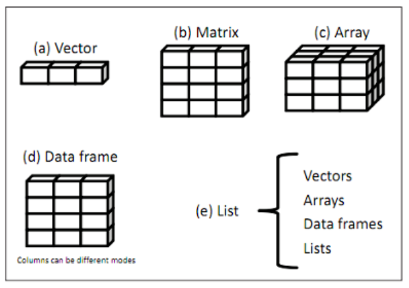

### 🎯 예제 4: R의 자료 구조 5가지 💡

R은 데이터 분석에서 다양한 자료 구조를 지원하며, 각각의 자료 구조는 특정 목적에 최적화되어 있습니다.  

아래에서 R의 주요 자료 구조 5가지를 소개합니다.

---  
  

#### **R의 자료 구조**  

1️⃣ **Vector: 같은 데이터 타입을 갖는 1차원 배열 구조** 📋  
   - R에서 가장 기본적인 데이터 구조로, 동일한 데이터 타입을 가진 값을 저장합니다.  
   - 예시:  
     ```r
   


     
     ```

2️⃣ **Matrix: 같은 데이터 타입을 갖는 2차원 배열 구조** 🟦  
   - 행과 열로 구성된 데이터 구조로, 모든 원소가 같은 데이터 타입이어야 합니다.  
   - 예시:  
    ```r


     
     ```

3️⃣ **Array: 같은 데이터 타입을 갖는 다차원 배열 구조** 🔢  
   - 2차원 이상의 배열 데이터를 저장하는 데 사용됩니다.  
   - 예시:  
     ```r
 


     
     ```


4️⃣ **Data Frame: 서로 다른 데이터 타입을 갖는 2차원 배열 구조** 🧮  
   - 데이터베이스 테이블과 유사하며, 열마다 데이터 타입이 달라도 됩니다.  
   - 예시:  
     ```r


     
     ```

5️⃣ **List: 서로 다른 데이터 구조를 포함하는 중첩된 구조** 📦  
   - 다양한 데이터 구조(Vector, Matrix, Array, Data Frame)를 포함할 수 있는 가변적 데이터 구조입니다.  
   - 예시:  
     ```r
    


     
     ```

---

#### **자료 구조 간 차이점**

| **자료 구조**       | **차원**  | **데이터 타입** | **특징**                          |
|--------------------|-----------|----------------|-----------------------------------|
| **Vector**         | 1차원     | 단일            | 같은 타입의 원소로 구성           |
| **Matrix**         | 2차원     | 단일            | 행렬 형태의 데이터 저장           |
| **Array**          | 다차원    | 단일            | n차원 데이터 저장 가능            |
| **Data Frame**     | 2차원     | 다중            | 서로 다른 타입의 데이터 저장      |
| **List**           | 가변적    | 다중            | 중첩된 데이터 구조 저장 가능      |

---

#### **예제: emp 데이터 프레임의 구조 확인**  

**😊 실습**: emp 데이터 프레임의 구조를 확인해보세요!  
```r


```
