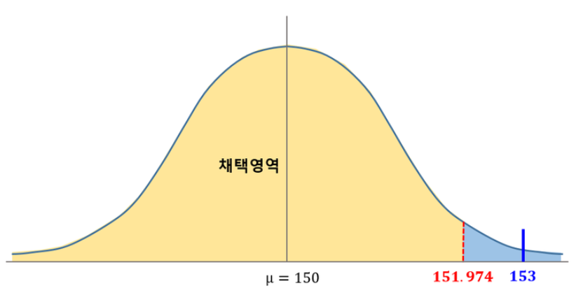

# 📊 통계적 가설검정의 시각적 이해

## 🎯 예제를 통한 가설검정 이해하기

### 📌 문제 상황  
  

어떤 제과회사의 "먹태깡" 과자의 지난해 평균 내용량은 150g, 표준편차는 12g이었다고 한다. 올해는 그보다 줄었을 것이라는 우려가 있어 임의로 100개의 과자를 조사하였더니 평균 153g이었다.

이때, 올해 "먹태깡"의 평균 내용량이 150g보다 줄었는지를 유의수준 α=0.05에서 검정하시오.

---

## 1️⃣ 가설 설정하기

```
귀무가설(H₀): μ = 150g
대립가설(H₁): μ < 150g
```

## 2️⃣ 가설검정의 시각적 이해

### 📊 정규분포 곡선의 의미 이해하기


> 💡 **중요 포인트**
> - 가운데 μ = 150을 중심으로 분포가 형성됩니다
> - 왼쪽 끝 부분에 유의수준 α = 0.05에 해당하는 기각역이 있습니다
> - 임계값이 기각영역의 경계가 됩니다

## 3️⃣ 임계값 계산하기

1. 유의수준 α = 0.05이므로 구하고자 하는 확률영역은 0.05입니다.
2. 표준정규분포표를 이용해 5%에 해당하는 z값을 찾으면:
   ```
   z = -1.645
   ```
3. 임계값(C.V.) 계산:
   ```
   -1.645 = (C.V - 150)/(12/√100)
   C.V = 148.026
   ```

### 임계값과 기각영역 시각화


## 4️⃣ 결론 도출하기

### 시각적 비교


### 📝 판단
- 표본평균 153g이 임계값 148.026g보다 크므로 기각영역에 포함되지 않습니다.
- 따라서 귀무가설을 기각할 수 없습니다.
- 결론: 올해 "먹태깡" 과자의 평균 내용량이 줄었다고 할 수 없습니다.

## ⚠️ 주의할 점

1. 통계적 가설검정에는 두 가지 오류가 있을 수 있습니다:
   - `[          ]`: 귀무가설이 참인데도 이를 기각하는 오류
   - `[          ]`: 귀무가설이 거짓인데도 이를 채택하는 오류

2. 표본평균이 임계값보다 작다면 귀무가설이 기각되었을 것입니다. 
   이 경우는 "올해 먹태깡의 평균 내용량이 반드시 150g보다 작다"가 아니라 
   "150g보다 작다고 할 수 있다"는 의미입니다.

---

<details>
<summary><b>✍️ 빈칸 정답 보기 </b></summary>

- 제1종 오류 (Type 1 error)
- 제2종 오류 (Type 2 error)

</details>

> 💡 **학습 도움말**
> - 정규분포 곡선에서 노란색 영역(채택영역)과 파란색 영역(기각영역)의 의미를 잘 이해하세요
> - 임계값은 채택영역과 기각영역을 구분하는 경계값임을 기억하세요
> - 실제 데이터(표본평균)가 임계값을 넘었는지를 확인하는 것이 검정의 핵심입니다
> - 제1종 오류와 제2종 오류의 차이점을 이해하는 것이 중요합니다  

---

### 참고: 그림참조 블로그
`https://blog.naver.com/mykepzzang/220884858347`
