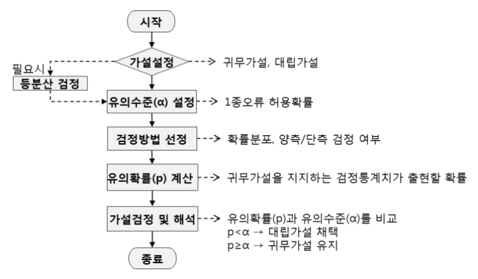

# 📊 가설검정의 절차

## 📌 개요

가설검정이란 설정된 가설(귀무가설)이 옳다고 할 때, 표본에서 `[          ]`을 사용하여 얻은 값(검정통계치)과 통계량의 이론적 분포에서 얻어지는 어떤 특정값(임계치)을 비교하여 그 가설을 기각할 것인가 또는 채택할 것인가를 판정하는 것이다.

모수에 대한 주장을 `[          ]`으로 판단하기 어려우므로 가설검정을 통해 주관적인 판단이 아닌 객관적인 의사결정을 할 수 있도록 한다. 이 때 오류의 가능성에 대해서 사전에 오류의 허용확률을 정해 놓고 가설의 채택이나 기각을 결정한다.

## 🔍 상세 절차

### 1️⃣ 가설 설정
- 연구하고자 하는 내용을 바탕으로 귀무가설과 대립가설을 설정
- `[          ]` 명확한 설정이 중요

### 2️⃣ 유의수준(α) 설정
- 제1종 오류의 허용확률 결정
- 일반적으로 `[          ]` 또는 0.01 사용

### 3️⃣ 검정방법 선정
- 표본의 특성에 따라 적절한 검정 방법 선택
- 표본 크기, 모집단의 분포 등을 고려
- `[          ]` 또는 단측/양측 검정 여부 결정

### 4️⃣ 유의확률(p) 계산
- 귀무가설을 지지하는 검정통계치가 실현될 확률
- 통계 프로그램이나 통계표를 이용하여 계산

### 5️⃣ 가설검정 및 해석
결론 도출 기준:
- p < α → `[          ]` 채택
- p ≥ α → `[          ]` 유지

---

<b>✍️ 빈칸 정답 보기</b>

- 통계량
- 시각적으로
- 귀무가설과 대립가설의
- 0.05
- t검정이나 z검정
- 대립가설
- 귀무가설

> 💡 **학습 도움말**
> - 각 단계는 순차적으로 진행되며, 이전 단계가 다음 단계에 영향을 미칩니다
> - 유의수준(α)은 가설검정 시작 전에 반드시 미리 정해야 합니다
> - 검정방법 선정 시 데이터의 특성을 잘 고려해야 합니다
> - p값과 α를 비교하여 최종 결론을 내립니다

