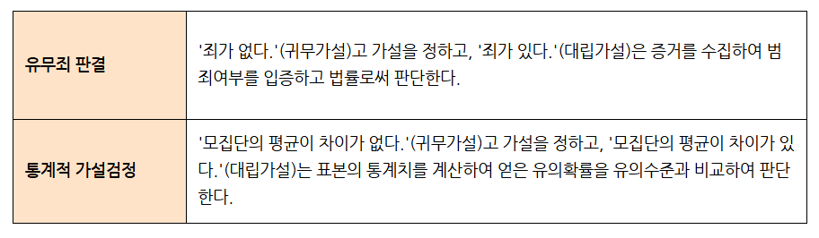
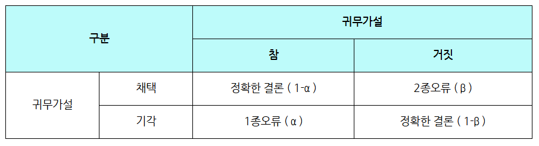

# 📊 귀무가설과 대립가설의 이해

## 1️⃣ 기본 개념

### 귀무가설 (H₀)
모집단의 모수가 어떤 특정한지 참다고 생각되는 잠정적 설정값이다. '<는, ≤은, =은' 등의 표현이 자주 쓰이고, '포함' 또는 '같다'로 표현된다.

### 대립가설 (H₁)
귀무가설과 반대되는 것으로 새롭게 주장하고자 하는 가설이다. 귀무가설과 배타적이며 동시에 성립될 수 없다. '있다', '크다', '작다', '또는 참이는 없다' 등으로 표현된다.

### 💡 중요한 개념

## 2️⃣ 유우적 판관과 통계적 가설검정

### 유우적 판관의 원칙

### 통계적 가설검정의 원칙

## 3️⃣ 가설검정의 오류

### 제1종 오류와 제2종 오류
프로세서 `[진실]`을 측정하는 과정에서 가설의 채택이나 `[         ]`를 잘못하는 경우도 있다. 이 오류의 의미는 다음과 같다.

가설검정에서 가설검정의 결론은 두 가지만 가능:
1) `[          ]`: 귀무가설이 옳은 데 잘못하여 기각하는 경우
2) `[          ]`: 귀무가설이 틀린 데 잘못하여 채택하는 경우

가설검정에서는 제1종 오류를 고려한다.

### 가설검정 오류의 정리

| 구분 | 귀무가설 |  |
|------|---------|---------|
|      | 참 | 거짓 |
| **귀무가설** | 정확한 판단 (1-α) | 제2종 오류 (β) |
|  | 제1종 오류 (α) | 정확한 판단 (1-β) |

---

<b>✍️ 빈칸 정답 보기</b>

- 진실
- 기각
- 제1종 오류
- 제2종 오류

> 💡 **학습 포인트**
> - 귀무가설과 대립가설은 서로 배타적인 관계입니다
> - 가설검정에서는 제1종 오류를 주로 고려합니다
> - 통계적 가설검정은 유우적 판관의 원칙과 유사한 논리를 따릅니다
> - 가설검정의 결론은 항상 귀무가설을 기준으로 내립니다

### 참고: 그림 참조 블러그
`https://blog.naver.com/richscskia/222006678420`
