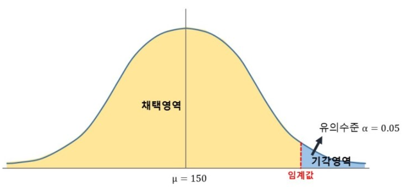

# 통계적 가설검정

가설검정은 어떤 가설을 세우고 그 가설이 맞는지 틀린지를 시험하는 것입니다. 통계적 가설검정에서는 통계 이론과 확률을 이용하여 가설을 검정합니다. 가설검정은 영어로 hypothesis test 입니다.

## 어떤 가설을 세울까

통계적 가설검정에서는 주로 어떤 가설을 세울까요? 통계량을 이용하여 가설을 세웁니다. 우리가 배우는 통계량은 평균, 분산이 있습니다. 통계량을 이용하여 세울 수 있는 가설의 예는 아래와 같습니다.

- 어떤 집단의 평균이 ○이다.
- 두 집단의 평균이 같다.
- 처리 전과 후 집단의 평균이 같다.

통계적 가설검정은 자료형, 표본수, 변수의 개수에 따라 다양한 검정 방법들이 존재하는데요. 나중에 정리해보기로 하고 가설검정이 뭔지 감부터 잡아봅시다.

---

## 귀무가설과 대립가설

모집단이 하나 있습니다. 이 모집단의 평균이 μ 라고 누군가 주장합니다. 우리는 이 주장이 틀렸다고 의심하고 있습니다. 이 때에선 두가지 가설을 세울 수 있습니다. 아래와 같은 가설입니다.

- **귀무가설** : 모집단의 평균이 μ 이다. (기존의 주장)
- **대립가설** : 모집단의 평균은 μ 가 아니다. (기존의 주장에 반대하는 우리의 주장)

귀무의 한자 뜻을 돌아갈(귀) 없을(무) 입니다. 무로 돌아가게 만들고 싶은 가설입니다. 우리가 무효화하고 싶은 기존의 주장입니다. 대립가설은 귀무가설과 대립하는 가설입니다. 대립가설이 '우리의 주장'이라고 생각하면 됩니다. 가설을 세울 때 주의할 점은 귀무가설과 대립가설은 서로 반대되는 내용이 되어야 합니다. 귀무가설은 null hypothesis, 대립가설은 alternative hypothesis 입니다. 혹시 지금 귀무가설과 대립가설이 무엇인지 이해되지 않았다면 괜찮습니다. 이후 강의들에서 실제 예시들을 통해 이해해봅시다.

---

## 표본추출

귀무가설이 맞는지 확인하기 위해서 모집단 전체를 조사하면 좋겠지만 모집단 전체를 조사하는데에는 시간과 비용이 너무 많이 듭니다. 이런 이유로 표본을 뽑는 것입니다. 모집단에서 표본을 하나 뽑아봅시다. 뽑힌 표본의 원소 수를 '표본의 크기'라고 부릅니다. 우리가 뽑은 표본의 평균을 \(X_1\), 분산을 \(s_1^2\) 이라고 놓습니다. 아래첨자는 첫번째 표본이라는 뜻입니다. 그림으로 나타내면 아래와 같습니다.

이번시간에는 통계적 가설검정의 핵심 개념인 귀무가설과 대립가설에 대해 알아봤습니다. 귀무가설은 '기존의 주장'이고 대립가설은 기존의 주장을 뒤엎고 싶은 '우리의 주장'이라는 사실만 기억합시다. 다음시간에는 통계적 가설검정의 원리를 배워보겠습니다.

표본평균의 평균이 모집단의 평균과 같다는 성질을 이용하면 위에서 설명한 귀무가설과 대립가설을 아래와 같이 표현할 수 있습니다.

- **귀무가설** : \(E[X] = μ\) (기존의 주장)
- **대립가설** : \(E[X] \neq μ\) (기존의 주장에 반대하는 우리의 주장)
