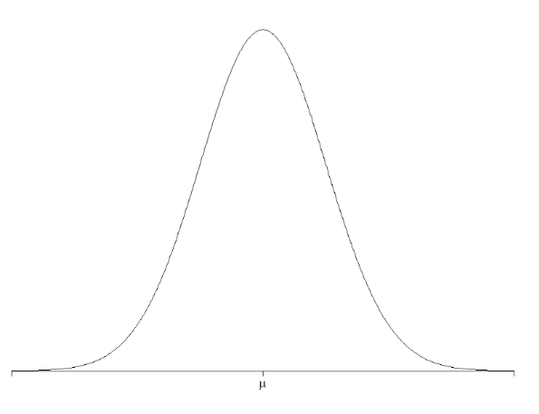
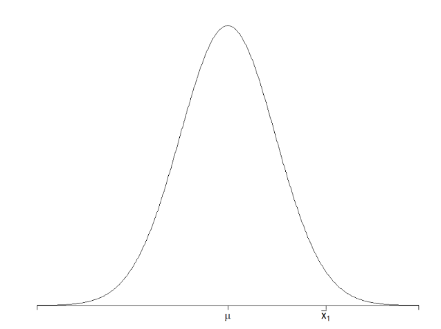
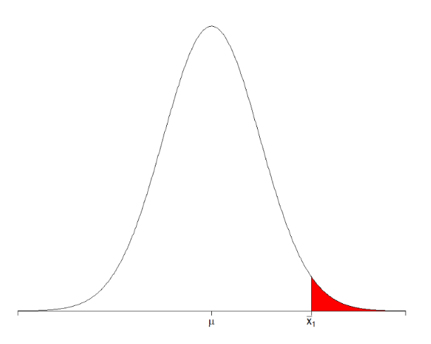

## 유의수준과 유의확률

가설검정에서 사용되는 중요한 개념인 유의수준과 유의확률에 대해 배워볼 것입니다.

어떤 사람이 모집단의 평균이 $\mu$ 라고 주장하고 있습니다. 우리는 아니라고 생각합니다.  

이를 밝히기 위해 두 가지 가설을 세웠습니다.

- **귀무가설** : $E[\bar{X}] = \mu$ (기존의 주장)
- **대립가설** : $E[\bar{X}] \neq \mu$ (기존의 주장에 반대하는 우리의 주장)

기존의 주장이 맞다고 가정하고 진행하겠습니다. 평균이 $\mu$ 인 모집단에서 크기가 $n$ 인 표본평균 분포함수를 정의했습니다.   

표본을 뽑지 않아도 분포함수를 정의할 수 있다는 것을 이미 배웠습니다. 아래와 같습니다.

$$
\bar{X} \sim N \left( \mu, \frac{\sigma^2}{n} \right)
$$

그래프로 나타내면 아래와 같습니다.

이 모집단에서 표본을 하나 뽑아서 평균을 구했습니다. 우리가 뽑은 표본의 평균을 $X_1$ 라고 합시다.  
                                                                       
그래프에 나타내면 아래와 같습니다.

이 표본보다 극단적인 값이 뽑일 확률을 구했더니 0.1% 가 나왔습니다. 그래프로 나타내면 아래와 같습니다.  

  

😊 **이렇게 구한 0.1%가 유의확률입니다. $p$-value 라고 부릅니다.**  

&nbsp;

&nbsp;

### 유의확률 ($p$-value)

우리가 뽑은 표본평균보다 극단적인 값이 뽑힐 확률을 의미합니다. 귀무가설이 참이라는 가정하에 진행한 결과입니다.  
  
우리는 여기에서 두 가지 선택지가 있습니다.

1. 0.1%라는 낮은 확률을 뚫고 표본이 뽑혔다.
2. 애초에 가설이 틀렸다.

두 번째 선택지가 직관적으로 더 맞을 가능성이 높습니다. 우리가 일반적으로 5%를 기준으로 정했습니다.   
  
이 5%가 유의수준입니다.

유의수준(significance level) 또는 기각 기준을 아래와 같이 정의합니다.

### 유의수준 ($\alpha$)

귀무가설을 기각시킬 기준이 되는 확률입니다.

실제로 유의수준은 연구자가 선택할 수 있습니다. 더 엄격한 기준을 원하면 유의수준을 1%로 설정할 수도 있습니다.

오늘 배운 유의확률과 유의수준을 요약하면 아래와 같습니다.

- **유의확률 ($p$-value)** : 우리가 받은 표본평균보다 극단적인 값이 뽑힐 확률
- **유의수준 ($\alpha$)** : 귀무가설을 기각시킬 기준이 되는 확률

쉽게 이해하면 아래와 같습니다.

**유의확률은 우리가 받은 점수이고, 유의수준은 커트라인입니다.**

커트라인보다 낮아야 우리의 주장이 '대립가설'에 채택됩니다.

한 가지 더 덧붙이자면, 현실에서는 유의수준을 5%로 많이 사용합니다. 하지만 귀무가설이 기각되는 조건은 아래와 같습니다.

$$
p\text{-value} < 0.025
$$

5%가 아니라 2.5%보다 작을 경우 기각됩니다. 왜 그럴까요? 이유는 다음 시간에 알아봅시다.

---

## 📌 확인 문제

다음 중 **유의확률(p-value)** 에 대한 올바른 설명은 무엇인가?

1. 유의확률이 높을수록 귀무가설을 기각할 가능성이 높아진다.
2. 유의확률이 낮을수록 귀무가설을 기각할 가능성이 높아진다.
3. 유의확률이 유의수준보다 높으면 귀무가설을 기각한다.
4. 유의확률은 항상 5% 이하로 설정된다.

<b>정답 보기</b>

**정답: 2. 유의확률이 낮을수록 귀무가설을 기각할 가능성이 높아진다.**

---

출처: `hsm-edu.tistory.com/129`
