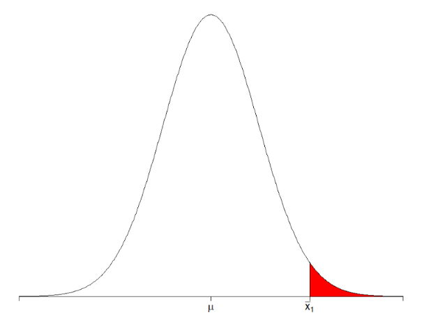

## 양측검정

그런데 여기서 한가지 생각해볼 문제가 있습니다. 위 경우는 우리가 구한 표본평균이 $\mu$ 보다 지나치게 크게 나왔기 때문에 모집단의 평균이 $\mu$ 라는 주장을 기각하는 것입니다. 반대로 우리가 구한 표본평균이 모집단보다 지나치게 작게 나와도 귀무가설은 기각될 수 있습니다. 따라서 기각되는 영역이 양쪽 끝에 존재하는 것입니다. 우리는 5% 이하를 기각하려고 한 것이므로, 한쪽에 2.5%씩을 기각하는 영역으로 놓아야 합니다. 그림으로 나타내면 아래와 같습니다.

우리가 뽑은 표본평균이 이 영역 안에 들어오면 귀무가설을 기각합니다. 이 영역을 '기각역'이라고 부릅니다. 위와 같이 기각역이 양쪽에 있는 경우를 **양측 검정**이라고 합니다. 영어로는 **two-tailed test** 라고 합니다. 꼬리가 양쪽에 있다는 의미입니다.

양측검정의 귀무가설은 아래와 같습니다.

- **귀무가설** : $E[\bar{X}] = \mu$ (기존의 주장)
- **대립가설** : $E[\bar{X}] \neq \mu$ (기존의 주장에 반대하는 우리의 주장)

---

## 단측검정

기각역이 한쪽에만 있는 **단측검정**도 존재합니다. 모집단이 $\mu$과 다르다고 주장하는게 아니라, 모집단의 평균이 $\mu$ 보다 크다고 주장하는 경우입니다. 귀무가설과 대립가설은 아래와 같습니다.

- **귀무가설** : $E[\bar{X}] = \mu$ (기존의 주장)
- **대립가설** : $E[\bar{X}] > \mu$ (기존의 주장에 반대하는 우리의 주장)

이런 경우에는 표본평균의 평균이 분포의 우측 극단에 있는 경우에만 귀무가설을 기각하고 대립가설을 채택할 수 있습니다. 따라서 기각역은 아래와 같습니다. 단측검정은 영어로 **one-tailed test** 입니다. 꼬리가 하나라는 뜻입니다.

만약 대립가설이 $E[\bar{X}] < \mu$ 라면 기각역은 좌측꼬리에 존재합니다.

---

## 단측검정과 양측검정 비교

단측검정과 양측검정의 차이를 표로 요약하면 아래와 같습니다.

---

## 📌 확인 문제

다음 중 **양측검정(two-tailed test)** 에 대한 올바른 설명은 무엇인가?

1. 기각역이 한쪽에만 존재한다.
2. 기각역이 양쪽에 존재한다.
3. 대립가설이 모집단의 평균보다 크거나 작다고 주장할 때 사용된다.
4. 표본평균이 극단적인 값을 가질 때 무조건 귀무가설을 기각한다.

<b>정답 보기</b>

**정답: 2. 기각역이 양쪽에 존재한다.**

---

출처: hsm-edu.tistory.com/129
