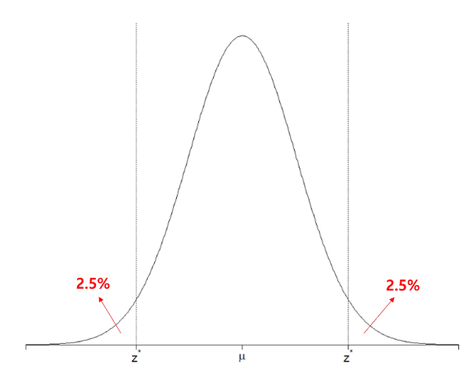
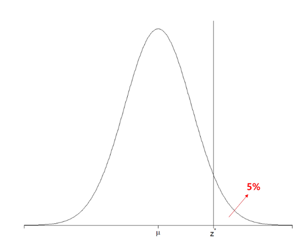
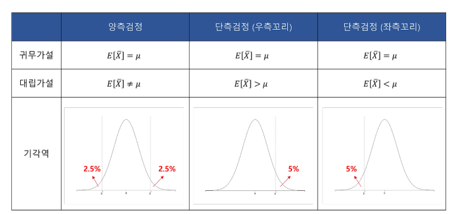

## 양측검정과 단측검정 개념 정리

가설 검정에서는 우리가 주장하는 가설이 기존의 주장과 다른지를 검증하는 과정이 필요합니다. 특히, 우리가 검토하는 가설이 기존과 다르다고 주장할 때는 **양측검정**, 한 방향으로만 다르다고 주장할 때는 **단측검정**을 사용합니다.

---

### 1. 양측검정 (Two-Tailed Test)

양측검정은 모집단의 평균이 특정 값과 다르다는 것을 검증하는 방법입니다. 즉, 표본평균이 너무 크거나 작으면 귀무가설을 기각하게 됩니다. 따라서 기각역이 양쪽 끝에 존재합니다.

#### 📌 귀무가설과 대립가설
- ✅ **귀무가설 (H₀)** : 모집단의 평균이 특정 값과 같다.
- ❌ **대립가설 (H₁)** : 모집단의 평균이 특정 값과 다르다.

#### 🎯 기각역
- 유의수준이 5%라면, 양쪽 끝에 각각 2.5%씩 기각역이 존재합니다.
- 우리가 구한 표본평균이 이 기각역 안에 들어가면 귀무가설을 기각합니다.

**예시 그림:**

---

### 2. 단측검정 (One-Tailed Test)

단측검정은 모집단의 평균이 특정 값보다 크거나 작다는 것을 검증하는 방법입니다. 기각역은 한쪽 끝에만 위치하게 됩니다.

#### (1) ▶ 우측 단측검정 (Right-Tailed Test)
- ✅ **귀무가설 (H₀)** : 모집단의 평균이 특정 값과 같다.
- ❌ **대립가설 (H₁)** : 모집단의 평균이 특정 값보다 크다.
- 기각역이 우측 꼬리에 위치하며, 표본평균이 지나치게 크면 귀무가설을 기각합니다.

**예시 그림:**

#### (2) ◀ 좌측 단측검정 (Left-Tailed Test)
- ✅ **귀무가설 (H₀)** : 모집단의 평균이 특정 값과 같다.
- ❌ **대립가설 (H₁)** : 모집단의 평균이 특정 값보다 작다.
- 기각역이 좌측 꼬리에 위치하며, 표본평균이 지나치게 작으면 귀무가설을 기각합니다.

---

### 3. ⚖ 단측검정과 양측검정 비교

단측검정과 양측검정의 차이를 표로 정리하면 다음과 같습니다.

---

### 4. 🎯 확인 문제

**다음 중 양측검정 (Two-Tailed Test)에 대한 올바른 설명은 무엇인가?**

1️⃣ 기각역이 한쪽에만 존재한다.

2️⃣ 기각역이 양쪽에 존재한다.

3️⃣ 대립가설이 모집단의 평균보다 크거나 작다고 주장할 때 사용된다.

4️⃣ 표본평균이 극단적인 값을 가질 때 무조건 귀무가설을 기각한다.

<b>✅ 정답 보기</b>

**정답: 2️⃣ 기각역이 양쪽에 존재한다.**

---
그림 출처: `hsm-edu.tistory.com/146`
