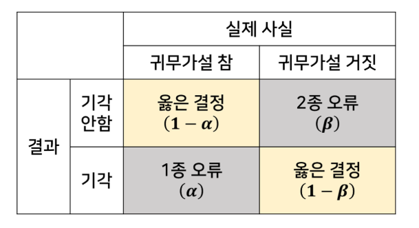
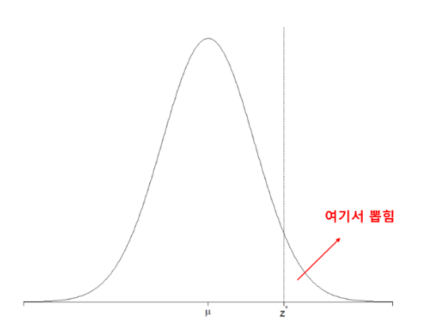
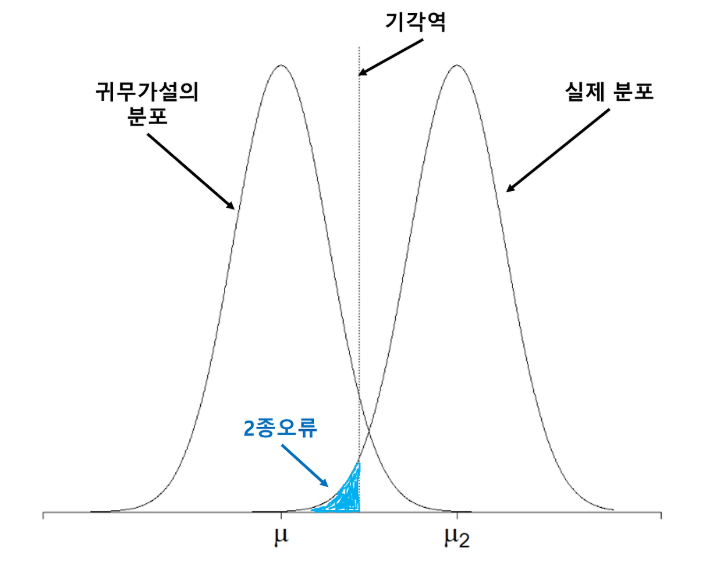

## 통계적 가설검정과 오류

통계적 가설검정은 귀무가설과 대립가설을 세우고 $p$ 값에 따라 기각 여부를 결정하는 것을 말합니다. 통계적 가설검정에는 아래와 같은 네 가지 상황이 발생할 수 있습니다.

1. 귀무가설이 참 → 채택
2. 귀무가설이 참 → 기각 (**1종 오류, $\alpha$ 오류**)
3. 귀무가설이 거짓 → 채택 (**2종 오류, $\beta$ 오류**)
4. 귀무가설이 거짓 → 기각

쉽게 이해하기 위해 아래와 같은 표를 만들어 봅니다.

통계적 가설검정은 확률이 개입되기 때문에 항상 옳은 결정을 내릴 수 없습니다. 실제로 귀무가설이 참인데 기각할 수도 있고, 귀무가설이 거짓인데 채택할 수도 있습니다. 이러한 잘못된 선택을 **오류**라고 합니다. 귀무가설이 참인데도 기각하는 오류를 **1종 오류 또는 $\alpha$ 라고 하고 유의수준** 라고 합니다. 귀무가설이 거짓인데도 기각하지 않는 오류를 **2종 오류 또는 $\beta$** 라고 표기 합니다. 각 오류를 하나씩 자세히 알아봅시다.

---

## 1종 오류 ($\alpha$ 오류)

1종 오류는 귀무가설이 참인 상황에서, 우리가 뽑은 표본이 실제로 기각역에서 뽑힐 때 발생합니다. 낮은 확률의 사건이 발생한 것입니다. 그럴 리 없다고 생각해서 기각했는데 그런 일이 벌어진 것이죠.

기각역의 넓이는 유의수준과 같으므로, 1종 오류가 발생할 확률은 유의수준 $\alpha$ 와 같습니다. 1종 오류를 $\alpha$ 오류라고 부르는 이유입니다.

---

## 2종 오류 ($\beta$ 오류)

2종 오류는 귀무가설이 거짓인 상황에서 발생합니다. 누군가 귀무가설의 평균이 $\mu$ 라고 주장하는데, 실제는  $\mu_2$ 라고 해봅시다. 이 상황을 확률분포로 표현하면 아래와 같습니다.

우리가 표본을 뽑는 모집단의 실제 분포는 오른쪽 분포이므로, 귀무가설이 거짓임에도 채택할 확률은 $\beta$ 입니다. 따라서 2종 오류의 확률은 $\beta$ 입니다. 2종 오류는 $\beta$ 오류라고도 부릅니다.

귀무가설이 거짓일 때, 2종 오류가 발생하지 않을 확률은 $1 - \beta$ 입니다. 귀무가설이 거짓인 상황에서 옳은 결정을 할 확률입니다.

1종 오류와 2종 오류는 trade-off 관계를 가집니다. 위 기각역을 오른쪽으로 이동시키면 1종 오류인 $\alpha$ 는 줄어들지만 2종 오류인 $\beta$ 는 늘어나게 됩니다. 기각역을 왼쪽으로 이동시키면 반대의 결과가 나타납니다.

---

## 📌 확인 문제

다음 중 **1종 오류(Type I Error)** 에 대한 설명으로 올바른 것은 무엇인가?

1. 귀무가설이 거짓인데 채택하는 오류이다.
2. 귀무가설이 참인데 기각하는 오류이다.
3. 귀무가설이 거짓인데 기각하는 오류이다.
4. 귀무가설이 참인데 채택하는 오류이다.

<b>정답 보기</b>

**정답: 2. 귀무가설이 참인데 기각하는 오류이다.**

---

출처: `hsm-edu.tistory.com/129`
