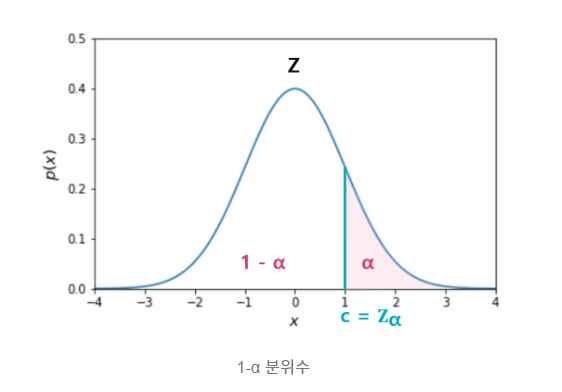
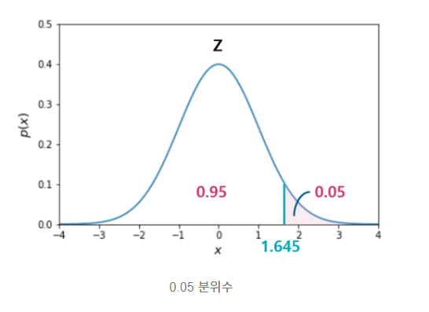
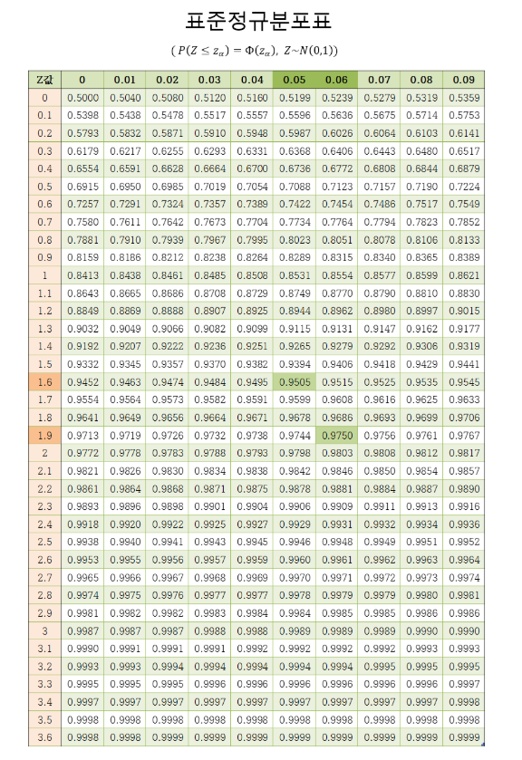
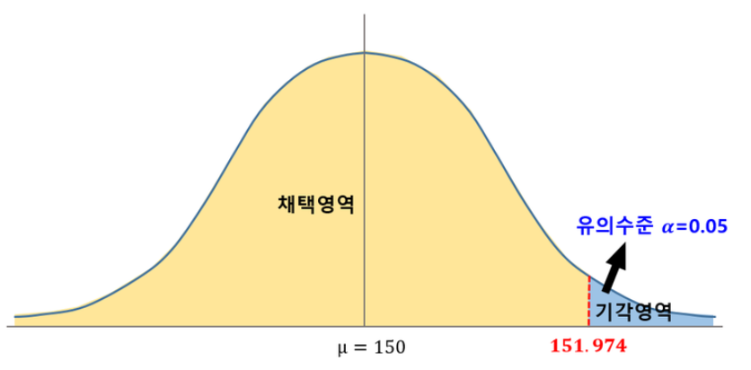

# 📊 통계적 가설검정의 시각적 이해

## 🎯 예제를 통한 가설검정 이해하기

### 📌 문제 상황
어떤 회사의 계약직의 지난해 평균월급은 150만원, 표준편차는 12만원이었다고 한다.
올해는 그보다 높을 것이라고 생각하여 임의로 계약직 사원 100명을 뽑아 평균 월급을 조사하였더니 153만원이었다.

이때, 올해 계약직 평균 월급이 150만원 이상이라고 할 수 있는지를 유의수준 α=0.05에서 검정하시오.

---

## 1️⃣ 가설 설정하기

```
귀무가설(H₀): μ = 150만원
대립가설(H₁): μ > 150만원
```

## 2️⃣ 가설검정의 시각적 이해

### 📊 정규분포 곡선의 의미 이해하기


> 💡 **중요 포인트**
> - 가운데 μ = 150을 중심으로 분포가 형성됩니다
> - 오른쪽 끝 부분에 유의수준 α = 0.05에 해당하는 기각역이 있습니다
> - 임계값이 기각영역의 경계가 됩니다

## 3️⃣ 임계값 계산하기

1. 유의수준 α = 0.05이므로 구하고자 하는 확률영역은 0.95입니다.
2. **표준정규분포표**를 이용해 95%에 해당하는 z값을 찾으면:
     
   ```
   z = 1.645
   ```
   

📌**표준정규분포표**를 통해서 z 검정통계량 찾는방법:  

 표준정규분포는 정규분포의 평균이 0, 분산이 1인 특수한 경우로,  
 "밀도함수의 곡선 아래 면적"으로 어떤 구간에 대한 확률을 구할 수 있다.  
 





\( Z_{0.05} \), 즉 0.95 분위수인 값을 찾고자 하면,  
표에서 0.95를 먼저 찾은 뒤 이에 해당하는 행의 이름 1.6과 열의 이름 0.05를 더해  
누적확률 값이 **1.65**임을 볼 수 있다. 정확하게 **1.645**  입니다.


3. 평균(150)을 기준으로 임계값(Critical Value) 계산하기:
     
  

**📌상단 그래프: 표준정규분포 (Z-분포)**
- **Z-값 기준선 (1.645)**  
  - 유의수준 **α = 0.05**를 적용하면,  
    **오른쪽 꼬리 영역(기각역)**에 해당하는 **Z-값은 1.645**입니다.
  - 즉, **Z = 1.645 이상이면 귀무가설을 기각**하게 됩니다.

- **누적확률 0.95**  
  - **Z = 1.645** 기준 왼쪽 면적은 **0.95 (95%)**  
  - 오른쪽 꼬리 영역(기각역)은 **0.05 (5%)**

---

#### **📌하단 그래프: 실제 데이터 (평균 μ = 150)**
이제 **Z-값을 다음과 같이 실제 데이터(X) 값으로 변환**해야 합니다.  




#### **📌 주어진 정보**
- 기존 평균 (**μ**) = **150**
- 표준편차 (**σ**) = **12**
- 표본 크기 (**n**) = **100**

#### **📌 표준오차(표본 표준편차) 계산**


표준오차(SE)를 구하는 공식은 다음과 같습니다.

SE = (표준편차) / (표본 크기의 제곱근)  
   = 12 / sqrt(100)  
   = 12 / 10  
   = 1.2  

즉, 표준오차(SE)는 **1.2**입니다.


#### 📌 Z-값을 실제 데이터(X) 값으로 변환하는 공식

검정 통계량을 실제 데이터로 변환하는 공식은 다음과 같습니다.

X = (모집단의 평균) + (Z 값 × 표준오차)  

유의수준 5%에서의 **Z 값이 1.645**이므로 이를 대입하면,

X = 150 + (1.645 × 1.2)  
X = 150 + 1.974  
X = 151.974  

---

## 4️⃣ 결론

**따라서, 표본인 사원 100명의 평균월급이 153만원이므로 151.974 이상이어서 귀무가설을 기각할 수 있습니다.**  

즉, **표본 평균이 151.974 이상이면 모집단의 평균이 150보다 크다고 결론 내릴 수 있습니다.**

- **위의 상단 그래프**에서 **Z = 1.645**가 오른쪽 기각역(α=0.05)의 기준임을 보여줍니다.
  
- **위의 하단 그래프**에서 이 Z-값을 실제 데이터로 변환하면 **임계값(Critical Value) = 151.974**이 됩니다.
  
- 따라서 **샘플 평균이 151.974 이상이면 유의수준 5%에서 "평균이 150보다 크다"는 주장을 채택할 수 있습니다.**

---


### 참고: 그림참조 블로그
`https://blog.naver.com/mykepzzang/220884858347`  
`https://modern-manual.tistory.com/entry/표준정규분포표-보는법-및-이미지-파일`
