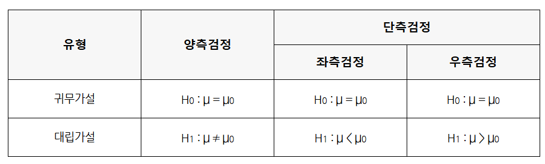
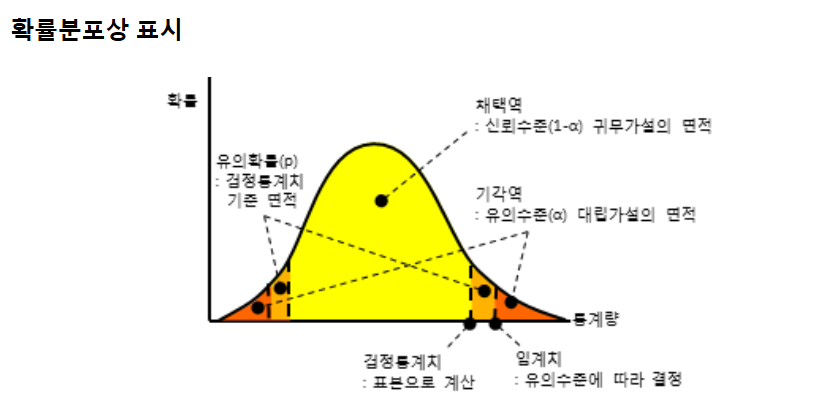
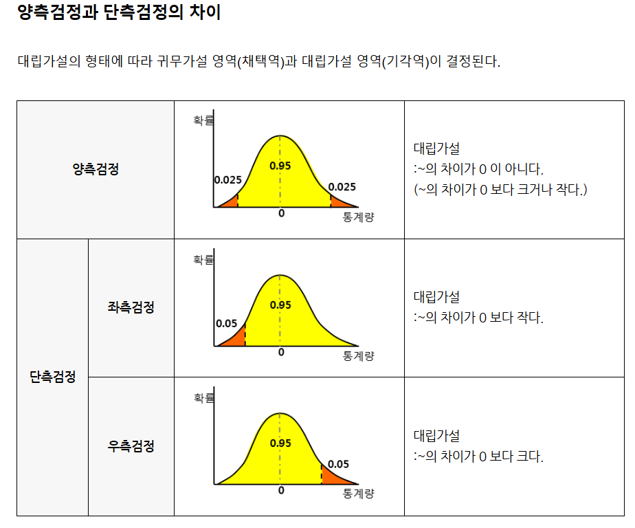

# 📊 가설검정의 주요 개념

## 1️⃣ 기본 개념들

### `[          ]` (α)
귀무가설이 옳은 상황임에 이를 옳지 기각하여 대립가설을 채택하는 제1종오류의 허용수준을 말한다. 일반적으로 0.05로 많이 사용된다. (그 외에 0.1, 0.01 도 사용된다.)

### `[          ]`
주어진 유의수준에서 귀무가설의 채택 또는 기각을 결정하는데 사용되는 기준값이다. 사용된 확률분포와 유의수준이 결정되면 임계치가 자동적으로 정해진다.

### `[          ]`
귀무가설을 채택 또는 기각 여부를 결정하기 위해 표본을 통해 계산된 값이다.

### `[          ]` (p)
귀무가설이 옳을 때 귀무가설을 지지하는 검정통계치가 실현된 확률로 자료를 통해 계산된 유의확률과 임의로 정한 유의수준을 자동적으로 결정한다.

## 2️⃣ 가설 검정의 결과

### `[          ]`
검정통계치가 발생될 확률이 유의수준보다 큰 영역으로 귀무가설 영역이 된다.

### `[          ]`
검정통계치가 발생될 확률이 유의수준보다 작은 영역으로 대립가설 영역이 된다.

## 3️⃣ 검정의 종류

### `[          ]`와 `[          ]`
다음과 같이 정리해 보면:
1) 양측검정 : 가설검정에서 귀무가설을 기각할 영역(대립가설을 채택할 영역)이 양쪽에 위치한다.
2) 단측검정 : 가설검정에서 귀무가설을 기각할 영역(대립가설을 채택할 영역)이 한쪽에 위치한다.

### 확률분포상 표시

### 양측검정과 단측검정의 차이

---

<b>✍️ 빈칸 정답 보기</b>

- 유의수준
- 임계치
- 검정통계치
- 유의확률
- 채택역
- 기각역
- 양측검정
- 단측검정

> 💡 **학습 도움말**
> - 유의수준(α)과 유의확률(p)의 차이를 이해하는 것이 중요합니다
> - 임계치는 채택역과 기각역을 구분하는 경계값입니다
> - 양측검정과 단측검정의 차이는 기각역의 위치로 구분됩니다
> - 검정통계치와 임계치의 비교를 통해 최종 결론을 내립니다   

### 참고: 그림 참조 블로그 
`https://blog.naver.com/richscskia/222006678420`
