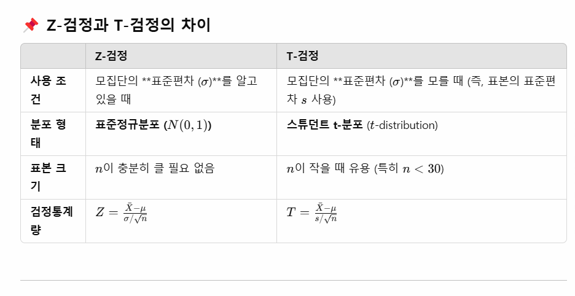

# 예제52: 가설검정2 - 단일 모집단의 모평균 검정
## - 분산을 모르는 경우(t 검정)

### 📊 가설검정의 유형

  


## 1️⃣ 이론설명

### t 검정이란?
- 모집단의 분산(σ²)을 모르는 경우에 사용하는 검정 방법
- 표본의 표준편차(s)를 사용
- 검정통계량은 자유도가 (n-1)인 t분포를 따름

### 검정통계량
$$t = \frac{\bar{X} - \mu_0}{s/\sqrt{n}}$$

여기서:
- $\bar{X}$ : 표본평균
- $\mu_0$ : 귀무가설에서의 모평균
- $s$ : 표본표준편차
- $n$ : 표본의 크기

   


## 2️⃣ 양측검정

### 📌 문제 상황
A회사는 자사의 에너지 음료가 평균적으로 200mg의 카페인을 함유하고 있다고 주장한다. 
이를 검증하기 위해 무작위로 25개의 제품을 선택하여 카페인 함량을 측정했더니, 
표본평균이 195mg이고 표본표준편차가 10mg으로 나타났다. 
유의수준 5%에서 회사의 주장이 옳다고 할 수 있는가?

### 풀이 과정

1. 가설 설정
```
H₀: μ = 200 (회사의 주장이 맞다)
H₁: μ ≠ 200 (회사의 주장이 틀리다)
```

2. 검정통계량 계산
```r


```

     
     

## 3️⃣ 단측검정(좌측검정)

<details>
<summary><b>🎯 문제</b></summary>

한 학급의 수학 성적이 평균 70점 이상이라고 주장한다. 
이를 검증하기 위해 이 학급에서 16명을 무작위로 선발하여 시험을 보았더니 
평균이 68점, 표준편차가 5점이었다. 
유의수준 5%에서 이 주장이 옳다고 할 수 있는가?

1) 가설을 설정하시오
2) 검정통계량을 계산하시오
3) 결론을 내리시오
4) R코드로 분석하시오
</details>

<details>
<summary><b>✍️ 정답</b></summary>

1) 가설 설정 (좌측검정)
   - H₀: μ ≥ 70
   - H₁: μ < 70

2) 검정통계량
   $$t = \frac{68 - 70}{5/\sqrt{16}} = -1.60$$

3) α = 0.05, 자유도 = 15일 때 임계값 = -1.753
   |-1.60| < 1.753이므로 귀무가설 기각 실패

4) R코드
```r


```
</details>


  
## 3️⃣ 단측검정 (우측검정)

<details>
<summary><b>🎯 문제</b></summary>

어떤 제약회사는 새로운 혈압약이 기존 혈압 조절제보다 더 효과적이라고 주장하고 있다.  
이를 검증하기 위해 **16명의 환자를 무작위로 선발**하여 새로운 혈압약을 투여한 후 혈압을 측정한 결과,  
**평균 혈압이 130mmHg**, 표본 표준편차는 **5mmHg**로 나타났다.  
과거 연구에서 혈압 조절제 복용자의 **평균 혈압은 125mmHg**였다.  

유의수준 5%에서 **새로운 혈압약이 혈압을 증가시키는 효과가 있는지** 우측검정을 수행하라.

1) 가설을 설정하시오  
2) 검정통계량을 계산하시오  
3) 결론을 내리시오  
4) R코드로 분석하시오  

</details>

```r


```
1) **가설 설정 (우측검정)**  
   - 귀무가설 (H₀): 새로운 혈압약이 기존 약과 차이가 없다. (평균 혈압 ≤ 125)  
   - 대립가설 (H₁): 새로운 혈압약이 혈압을 증가시킨다. (평균 혈압 > 125)  

2) **검정통계량 계산**  
   - t = (130 - 125) / (5 / sqrt(16)) = 4.00  

3) **임계값 계산 (자유도 15, 유의수준 5%)**  
   - t 임계값 = qt(0.95, 15) = 1.753  
   - 검정통계량 4.00 > 임계값 1.753이므로 **귀무가설을 기각**  
   - **결론**: 새로운 혈압약이 **혈압을 증가시킨다고 할 수 있다.**  


> 💡 **핵심 포인트**
> - t 검정은 모분산을 모를 때 사용합니다
> - 자유도는 표본크기보다 1이 작습니다 (n-1)
> - 표본크기가 작을 때(n<30)는 특히 t 검정이 중요합니다
> - 단측/양측 검정에 따라 임계값과 p-value 계산이 달라집니다
