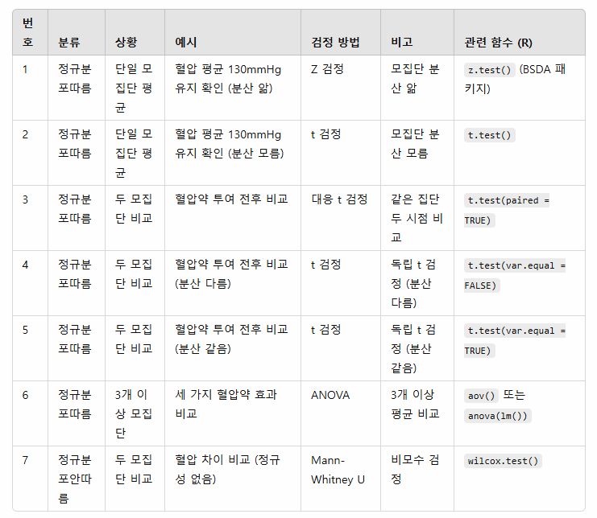

# 예제54: 가설검정4 - 두 모집단의 모평균 차이 검정
## - 독립표본, 이분산 (Welch's t 검정)

### 📊 가설검정의 유형



## 1️⃣ 이론 설명

### Welch's t 검정이란?
- 서로 독립인 두 모집단의 평균 차이를 검정
- 두 모집단의 분산이 다르다고 가정 (이분산)
- 자유도가 수정된 t분포를 사용

### 검정통계량
$$t = \frac{(\bar{X}_1 - \bar{X}_2) - (\mu_1 - \mu_2)}{\sqrt{\frac{s_1^2}{n_1} + \frac{s_2^2}{n_2}}}$$

여기서:
- $\bar{X}_1, \bar{X}_2$ : 각 표본의 평균
- $s_1^2, s_2^2$ : 각 표본의 분산
- $n_1, n_2$ : 각 표본의 크기

### 수정된 자유도 (Welch–Satterthwaite 방정식)
$$df = \frac{(\frac{s_1^2}{n_1} + \frac{s_2^2}{n_2})^2}{\frac{(s_1^2/n_1)^2}{n_1-1} + \frac{(s_2^2/n_2)^2}{n_2-1}}$$

## 2️⃣ 예제 풀이

### 📌 문제 상황
두 회사의 고객 만족도를 비교하고자 한다. A회사에서 20명을 조사한 결과 평균 85점(s₁=15), 
B회사에서 25명을 조사한 결과 평균 78점(s₂=8)이었다. 
분산이 다르다고 가정할 때, 유의수준 5%에서 두 회사의 고객 만족도에 차이가 있다고 할 수 있는가?

### 풀이 과정

1. 가설 설정
```
H₀: μ₁ - μ₂ = 0 (두 회사의 고객 만족도는 같다)
H₁: μ₁ - μ₂ ≠ 0 (두 회사의 고객 만족도는 다르다)
```

2. R코드로 분석
```r
# 📌 1. 데이터 설정
n1 <- 20; n2 <- 25      # 표본 크기
x1_bar <- 85; x2_bar <- 78  # 표본 평균
s1 <- 15; s2 <- 8       # 표본 표준편차
alpha <- 0.05           # 유의수준 설정

# 📌 2. 정규분포에서 난수 생성 (표본 데이터 만들기)
set.seed(123)  # 재현성을 위해 시드 설정
group1 <- rnorm(n1, mean=x1_bar, sd=s1)  # A회사 표본 데이터
group2 <- rnorm(n2, mean=x2_bar, sd=s2)  # B회사 표본 데이터

# 📌 3. Welch의 t-검정 수행 (이분산 가정)
t_result <- t.test(group1, group2, var.equal=FALSE, alternative="two.sided")

# 📌 4. 결과 출력
print(t_result)

# 📌 5. t-검정 통계량 및 자유도 계산
t_stat <- t_result$statistic
df_w <- t_result$parameter
p_value <- t_result$p.value

# 임계값 계산
t_crit <- qt(1 - alpha/2, df_w)

# 📌 6. 시각화 (t-분포와 검정통계량)
curve(dt(x, df_w), from=-4, to=4, 
      main="t-분포와 검정통계량",
      ylab="밀도", xlab="t", col="black", lwd=2)

# 임계값 (Critical value) 표시
abline(v=c(-t_crit, t_crit), col="red", lty=2, lwd=2)

# 검정 통계량 (t-statistic) 표시
abline(v=t_stat, col="blue", lwd=3)

# 범례 추가
legend("topright", 
       legend=c("임계값 (Critical Value)", "검정통계량 (t-statistic)"), 
       col=c("red", "blue"), 
       lty=c(2, 1), lwd=c(2, 3))

# 📌 7. 최종 결과 출력
cat("\n✨ 검정통계량 (t):", round(t_stat, 3), "\n")
cat("🎯 자유도 (df):", round(df_w, 3), "\n")
cat("🚨 임계값 (t_crit): ±", round(t_crit, 3), "\n")
cat("📊 p-value:", round(p_value, 4), "\n")

# 귀무가설 기각 여부 판단
if (p_value < alpha) {
  cat("\n🔴 결론: 유의수준 5%에서 귀무가설 기각! 두 그룹의 평균은 통계적으로 유의미한 차이가 있음.\n")
} else {
  cat("\n🔵 결론: 유의수준 5%에서 귀무가설 기각 실패. 두 그룹의 평균 차이는 유의미하지 않음.\n")
}

```

3. 결론 도출
- t 통계량 = 1.892
- 수정된 자유도 = 29.144
- p-value = 0.0684 > 0.05
- 따라서 귀무가설을 기각할 수 없고, 두 회사의 고객 만족도에 유의한 차이가 있다고 할 수 없다.

## 3️⃣ 연습문제

<details>
<summary><b>🎯 문제</b></summary>

두 학급의 수학 성적을 비교하고자 한다. 
A반(n₁=15)의 평균은 82점(s₁=12), B반(n₂=18)의 평균은 75점(s₂=6)이었다.
분산이 다르다고 가정할 때, 유의수준 5%에서 A반의 성적이 B반보다 높다고 할 수 있는가?

1) 가설을 설정하시오
2) 검정통계량을 계산하시오
3) 결론을 내리시오
4) R코드로 분석하시오
</details>

<details>
<summary><b>✍️ 정답</b></summary>

1) 가설 설정 (우측검정)
   - H₀: μ₁ - μ₂ ≤ 0
   - H₁: μ₁ - μ₂ > 0

2) R코드 분석
```r
# 📌 1. 데이터 설정
n1 <- 15; n2 <- 18      # 표본 크기
x1_bar <- 82; x2_bar <- 75  # 표본 평균
s1 <- 12; s2 <- 6       # 표본 표준편차
alpha <- 0.05           # 유의수준 설정

# 📌 2. 정규분포에서 난수 생성
set.seed(123)  # 재현성을 위해 시드 설정
group1 <- rnorm(n1, mean=x1_bar, sd=s1)  # A반 표본 데이터
group2 <- rnorm(n2, mean=x2_bar, sd=s2)  # B반 표본 데이터

# 📌 3. Welch의 t-검정 수행 (이분산 가정, 우측검정)
t_result <- t.test(group1, group2, var.equal=FALSE, alternative="greater")

# 📌 4. 결과 출력
print(t_result)

# 📌 5. 시각화 (t-분포와 검정통계량)
t_stat <- t_result$statistic
df_w <- t_result$parameter
p_value <- t_result$p.value
t_crit <- qt(1-alpha, df_w)

curve(dt(x, df_w), from=-4, to=4, 
      main="t-분포와 검정통계량",
      ylab="밀도", xlab="t", col="black", lwd=2)

abline(v=t_crit, col="red", lty=2, lwd=2)  # 임계값
abline(v=t_stat, col="blue", lwd=3)  # 검정통계량

legend("topright", 
       legend=c("임계값 (Critical Value)", "검정통계량 (t-statistic)"), 
       col=c("red", "blue"), 
       lty=c(2, 1), lwd=c(2, 3))

# 📌 6. 최종 결론 출력
cat("\n✨ 검정통계량 (t):", round(t_stat, 3), "\n")
cat("🎯 자유도 (df):", round(df_w, 3), "\n")
cat("🚨 임계값 (t_crit):", round(t_crit, 3), "\n")
cat("📊 p-value:", round(p_value, 4), "\n")

if (p_value < alpha) {
  cat("\n🔴 결론: A반의 성적이 B반보다 유의미하게 높음.\n")
} else {
  cat("\n🔵 결론: A반의 성적이 B반보다 유의미하게 높다고 할 수 없음.\n")
}

```

3) 결과 해석
- t 통계량 = 2.105
- 수정된 자유도 = 19.423
- p-value = 0.0244 < 0.05
- 따라서 귀무가설을 기각하고, A반의 성적이 B반보다 높다고 할 수 있다

</details>

> 💡 **핵심 포인트**
> - 이분산 가정 시 일반 t검정 대신 Welch's t검정을 사용합니다
> - 자유도가 수정되어 계산됩니다
> - R에서는 t.test() 함수의 var.equal=FALSE 옵션으로 쉽게 계산할 수 있습니다
> - 표본 크기가 작고 분산 차이가 클 때 특히 중요합니다
