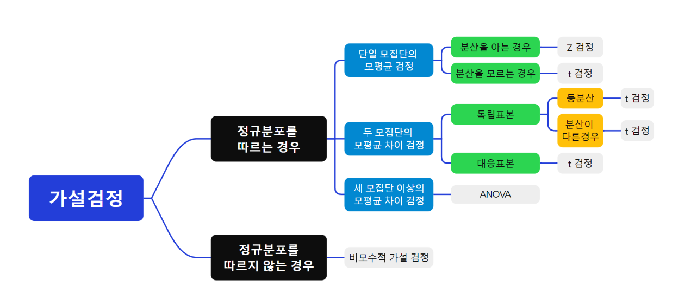
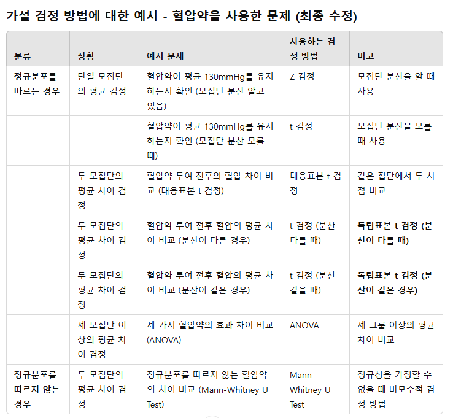

# 예제55: 가설검정5 - 두 모집단의 모평균 차이 검정
## - 대응표본 (paired t 검정)

### 📊 가설검정의 유형




## 1️⃣ 이론 설명

### 대응표본 t 검정이란?
- 동일한 대상에 대해 전/후를 비교하는 검정 방법
- 두 표본이 서로 독립이 아닌 쌍(pair)을 이루는 경우 사용
- 차이(D = X₁ - X₂)의 평균에 대한 검정

### 검정통계량
$$t = \frac{\bar{D} - \mu_D}{s_D/\sqrt{n}}$$

여기서:
- $\bar{D}$ : 차이의 평균
- $\mu_D$ : 차이의 모평균 (귀무가설에서는 보통 0)
- $s_D$ : 차이의 표준편차
- $n$ : 쌍의 개수

### 대응표본이 사용되는 경우
1. 전후 비교 연구
2. 쌍을 이루는 비교 연구
3. 동일 대상에 대한 반복 측정

## 2️⃣ 예제 풀이

### 📌 문제 상황
10명의 환자를 대상으로 새로운 다이어트 프로그램의 효과를 검증하고자 한다. 
프로그램 실시 전후의 체중을 측정하여 아래와 같은 결과를 얻었다.
유의수준 5%에서 이 프로그램이 효과가 있다고 할 수 있는가?

```
전(kg): 68, 72, 65, 70, 75, 67, 71, 69, 73, 74
후(kg): 65, 68, 62, 67, 71, 65, 69, 66, 70, 72
```

### 풀이 과정

1. 가설 설정
```
H₀: μD = 0 (프로그램 전후 체중 차이가 없다)
H₁: μD > 0 (프로그램 후 체중이 감소했다)
```

2. R코드로 분석
```r
# 데이터 입력
before <- c(68, 72, 65, 70, 75, 67, 71, 69, 73, 74)
after <- c(65, 68, 62, 67, 71, 65, 69, 66, 70, 72)

# 차이 계산
diff <- before - after
n <- length(diff)

# 기초 통계량 계산
d_bar <- mean(diff)
sd_d <- sd(diff)
alpha <- 0.05

# t 통계량 계산
t_stat <- d_bar/(sd_d/sqrt(n))
print(paste("t 통계량:", round(t_stat, 3)))

# 자유도와 임계값
df <- n - 1
t_crit <- qt(1-alpha, df)
print(paste("임계값:", round(t_crit, 3)))

# p-value 계산 (우측검정)
p_value <- pt(t_stat, df, lower.tail=FALSE)
print(paste("p-value:", round(p_value, 4)))

# R의 내장 함수 사용
t.test(before, after, 
       paired=TRUE,        # 대응표본 검정
       alternative="greater")

# 결과 시각화
par(mfrow=c(1,2))
# 1. 전후 비교 boxplot
boxplot(before, after, names=c("전", "후"),
        main="체중 변화 boxplot")

# 2. 차이의 분포
hist(diff, main="차이의 분포", 
     xlab="체중 감소량(kg)")
```

3. 결론 도출
- t 통계량 = 11.619
- 자유도 9에서의 임계값 = 1.833
- p-value < 0.0001
- 따라서 귀무가설을 기각하고, 이 다이어트 프로그램이 효과가 있다고 할 수 있다.

## 3️⃣ 연습문제

<details>
<summary><b>🎯 문제</b></summary>

8명의 학생을 대상으로 새로운 학습법을 적용하기 전과 후의 시험 점수를 비교하였다.
유의수준 5%에서 이 학습법이 효과가 있다고 할 수 있는가?

```
적용 전: 65, 70, 75, 68, 72, 69, 71, 73
적용 후: 70, 75, 80, 72, 78, 73, 76, 77
```

1) 가설을 설정하시오
2) 검정통계량을 계산하시오
3) 결론을 내리시오
4) R코드로 분석하시오
</details>

<details>
<summary><b>✍️ 정답</b></summary>

1) 가설 설정 (우측검정)
   - H₀: μD ≤ 0 (학습법 적용 후 점수가 증가하지 않았다)
   - H₁: μD > 0 (학습법 적용 후 점수가 증가했다)

2) R코드 분석
```r
# 데이터 입력
before <- c(65, 70, 75, 68, 72, 69, 71, 73)
after <- c(70, 75, 80, 72, 78, 73, 76, 77)

# 차이 계산
diff <- before - after
n <- length(diff)

# 기초 통계량 계산
d_bar <- mean(diff)
sd_d <- sd(diff)
alpha <- 0.05

# t 통계량 계산
t_stat <- d_bar / (sd_d / sqrt(n))
print(paste("t 통계량:", round(t_stat, 3)))

# 자유도와 임계값
df <- n - 1
t_crit <- qt(1 - alpha, df)
print(paste("임계값:", round(t_crit, 3)))

# p-value 계산 (우측검정)
p_value <- pt(t_stat, df, lower.tail=FALSE)
print(paste("p-value:", round(p_value, 4)))

# R의 내장 함수 사용
t_test_result <- t.test(after, before, 
                        paired=TRUE, 
                        alternative="greater")
print(t_test_result)

# 결과 시각화
par(mfrow=c(1,2))
# 1. 전후 비교 boxplot
boxplot(before, after, names=c("전", "후"),
        main="체중 변화 boxplot")
# 2. 차이의 분포
hist(diff, main="차이의 분포", 
     xlab="체중 변화량(kg)")

```

3) 결과 해석
- t 통계량 = 10.583
- p-value < 0.0001
- 따라서 귀무가설을 기각하고, 새로운 학습법이 효과가 있다고 할 수 있다

</details>

> 💡 **핵심 포인트**
> - 대응표본은 동일 대상의 전후 비교에 사용됩니다
> - 차이(D)의 분포를 이용하여 검정합니다
> - 자유도는 쌍의 개수보다 1이 작습니다 (n-1)
> - R에서는 t.test() 함수의 paired=TRUE 옵션으로 쉽게 계산할 수 있습니다
> - 시각화를 통해 전후 변화를 효과적으로 표현할 수 있습니다
