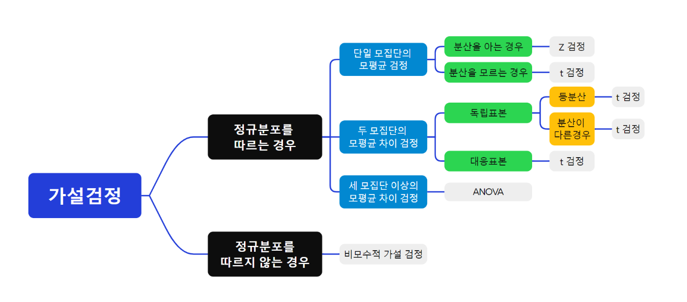

# 예제56: 가설검정6 - 세 모집단 이상의 모평균 차이 검정
## - 일원배치 분산분석 (One-way ANOVA)

### 📊 가설검정의 유형



## 1️⃣ 이론 설명

### ANOVA란?
- 세 개 이상의 모집단 평균을 비교하는 분석 방법
- 집단 간 분산과 집단 내 분산의 비율을 이용
- F분포를 따르는 검정통계량 사용

### 기본 가정
1. 독립성: 각 집단의 관측값은 서로 독립
2. 정규성: 각 집단은 정규분포를 따름
3. 등분산성: 모든 집단의 분산이 동일

### 분산분석표 구성
| 요인 | 제곱합(SS) | 자유도(df) | 평균제곱(MS) | F값 |
|------|------------|------------|--------------|-----|
| 처리 | SST | k-1 | MST | MST/MSE |
| 오차 | SSE | n-k | MSE | |
| 전체 | SST+SSE | n-1 | | |

여기서:
- k: 집단의 수
- n: 전체 관측값의 수

## 2️⃣ 예제 풀이

### 📌 문제 상황
세 가지 다른 교수법(A, B, C)의 효과를 비교하기 위해 각 방법별로 15명의 학생을 무작위로 선정하여 시험을 실시했다. 
유의수준 5%에서 세 교수법 간에 차이가 있는지 검정하시오.

```
교수법 A: 75, 82, 78, 80, 85, 81, 82, 77, 79, 83, 81, 80, 77, 82, 84
교수법 B: 70, 75, 72, 74, 77, 75, 76, 73, 71, 76, 75, 73, 72, 74, 76
교수법 C: 85, 88, 82, 84, 90, 86, 87, 83, 85, 88, 86, 84, 83, 87, 89
```

### 풀이 과정

1. 가설 설정
```
H₀: μ₁ = μ₂ = μ₃ (세 교수법의 효과는 같다)
H₁: μᵢ ≠ μⱼ for some i,j (적어도 한 쌍의 교수법 간에 차이가 있다)
```

2. R코드로 분석
```r
# 🎯 문제: 세 가지 운동 프로그램(X, Y, Z)의 체중 감량 효과 비교 (유의수준 5%)

# 0. 가설 설정
# H₀: 세 운동 프로그램(X, Y, Z) 간 평균 체중 감량에 차이가 없다.
# H₁: 적어도 한 그룹의 평균 체중 감량이 다른 그룹과 다르다.

# 1. 데이터 입력
program_X <- c(3.5, 4.2, 3.8, 4.0, 3.9, 4.1, 3.7, 4.3, 3.6, 4.0)  # 프로그램 X
program_Y <- c(2.8, 3.1, 2.9, 3.0, 3.2, 2.7, 3.0, 2.8, 3.1, 2.9)  # 프로그램 Y
program_Z <- c(4.5, 4.8, 4.6, 4.7, 4.9, 4.5, 4.8, 4.6, 4.7, 4.4)  # 프로그램 Z

# 2. 데이터프레임 생성
weight_loss <- data.frame(
  loss = c(program_X, program_Y, program_Z),
  program = factor(rep(c("X", "Y", "Z"), each = 10))
)

# 3. 기술통계량 계산
tapply(weight_loss$loss, weight_loss$program, function(x) {
  c(mean = mean(x), sd = sd(x))
})

# 4. ANOVA 분석
anova_result <- aov(loss ~ program, data = weight_loss)
summary(anova_result)

# 5. 사후검정 (Tukey's HSD)
TukeyHSD(anova_result)

# 6. 정규성 및 등분산성 검정
# (1) 정규성 검정 (Q-Q plot)
par(mfrow = c(1, 2))  # 1행 2열 레이아웃 설정
qqnorm(residuals(anova_result))
qqline(residuals(anova_result))

# (2) 등분산성 검정
bartlett.test(loss ~ program, data = weight_loss)

# 7. 데이터 시각화
# (1) 운동 프로그램별 체중 감량 비교 (Boxplot)
boxplot(loss ~ program, data = weight_loss,
        main = "운동 프로그램별 체중 감량 비교",
        ylab = "체중 감량 (kg)",
        xlab = "운동 프로그램")

# 8. 결과 해석
p_value <- summary(anova_result)[[1]][["Pr(>F)"]][1]  # p-value 추출
if (p_value < 0.05) {
  print("✅ 유의수준 5%에서 세 프로그램 간 체중 감량 차이가 유의미함")
} else {
  print("❌ 유의미한 차이가 없음. 즉, 운동 프로그램 효과 차이가 없을 가능성이 높음")
}

```

3. 결론 도출
- F통계량과 p-value 확인
- 사후검정 결과 해석
- 가정 검토 (정규성, 등분산성)
- 최종 결론 도출

## 3️⃣ 연습문제

<details>
<summary><b>🎯 문제</b></summary>

세 가지 다른 운동 프로그램(X, Y, Z)의 효과를 비교하기 위해 각 프로그램별로 10명의 참가자를 대상으로 체중 감량(kg)을 측정했다.
유의수준 5%에서 세 프로그램 간에 차이가 있는지 검정하시오.

```
프로그램 X: 3.5, 4.2, 3.8, 4.0, 3.9, 4.1, 3.7, 4.3, 3.6, 4.0
프로그램 Y: 2.8, 3.1, 2.9, 3.0, 3.2, 2.7, 3.0, 2.8, 3.1, 2.9
프로그램 Z: 4.5, 4.8, 4.6, 4.7, 4.9, 4.5, 4.8, 4.6, 4.7, 4.4
```

1) 가설을 설정하시오
2) R코드로 분석하시오
3) 결론을 도출하시오
</details>

<details>
<summary><b>✍️ 정답</b></summary>

```r
# 데이터 준비 및 분석
program_X <- c(3.5, 4.2, 3.8, 4.0, 3.9, 4.1, 3.7, 4.3, 3.6, 4.0)
program_Y <- c(2.8, 3.1, 2.9, 3.0, 3.2, 2.7, 3.0, 2.8, 3.1, 2.9)
program_Z <- c(4.5, 4.8, 4.6, 4.7, 4.9, 4.5, 4.8, 4.6, 4.7, 4.4)

weight_loss <- data.frame(
  loss = c(program_X, program_Y, program_Z),
  program = factor(rep(c("X", "Y", "Z"), each = 10))
)

# ANOVA 및 사후검정
result <- aov(loss ~ program, data = weight_loss)
summary(result)
TukeyHSD(result)

# 결론
# F값과 p-value < 0.05이므로 세 프로그램 간에 유의한 차이가 있음
# 사후검정 결과, 모든 프로그램 쌍 간에 유의한 차이가 있으며
# Z > X > Y 순으로 효과가 있음
```

</details>

> 💡 **핵심 포인트**
> - ANOVA는 세 개 이상 집단의 평균을 동시에 비교합니다
> - 기본 가정(독립성, 정규성, 등분산성)을 반드시 확인해야 합니다
> - 유의한 차이가 있을 경우 사후검정이 필요합니다
> - R의 aov() 함수로 쉽게 분석할 수 있습니다
> - 시각화를 통해 집단 간 차이를 효과적으로 표현할 수 있습니다
