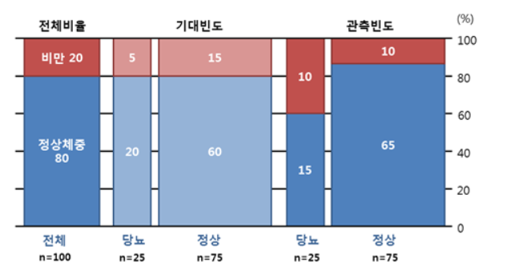
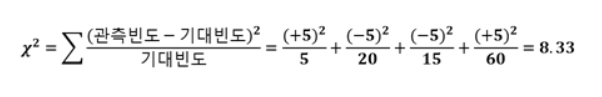

# 카이제곱 검정 (Chi-Square Test)

## 1. 카이제곱 검정이란?
카이제곱(Chi-Square) 분포는 1900년경 **칼 피어슨(Karl Pearson)** 에 의해 개발된 확률 분포로, 모집단에 대한 가설 검정이나 교차 분석(Contingency Table Analysis)에 유용하게 사용되는 검정 방법이다.

## 2. 카이제곱 검정의 종류
카이제곱 검정은 주로 두 가지 유형으로 나뉜다.

### 2.1. 적합도 검정 (Goodness-of-Fit Test)
- 한 개의 범주형 변수에 대해 특정 분포(예: 균등 분포, 정규 분포 등)와의 차이를 검정하는 방법이다.
- 예제: 주사위를 100번 던졌을 때, 각 면이 균등하게 나올 것이라는 가설을 검정.

### 2.2. 독립성 검정 (Test of Independence)
- 두 개 이상의 범주형 변수 간의 독립성을 검정하는 방법이다.
- 교차분석(Contingency Table Analysis)에서 두 변수 간의 관계가 있는지를 판단하는 데 사용된다.
- 예제: 흡연 여부와 폐암 발생 여부가 서로 독립적인지 검정.

## 3. 카이제곱 검정을 사용할 수 있는 데이터
카이제곱 검정은 **범주형 데이터(Categorical Data)** 에 대해 사용된다. 연속형 데이터(Continuous Data)에는 사용되지 않는다.

### 3.1. 사용할 수 있는 데이터 유형
- 성별 (남성 / 여성)
- 선호하는 브랜드 (A / B / C)
- 질병 유무 (있음 / 없음)
- 교육 수준 (고졸 / 대졸 / 대학원)

### 3.2. 사용할 수 없는 데이터 유형
- 키 (cm)
- 몸무게 (kg)
- 온도 (°C)
- 연령 (세)

## 4. 카이제곱 검정의 기본 가정
1. **데이터는 독립적인 표본이어야 한다.**
2. **기대 빈도(Expected Frequency)가 충분히 커야 한다.** (일반적으로 기대 빈도가 5 이상)
3. **범주형 데이터로 이루어져 있어야 한다.**


## 예제 1: 비만과 당뇨의 관계
아래의 2×2 크로스 집계표를 보고 두 변수가 연관성이 있는지 살펴봅시다.

### 1 관측 빈도 (Observed Frequency)
|      | 당뇨 | 정상 | 전체 |
|------|------|------|------|
| 비만 | 10   | 10   | 20   |
| 정상체중 | 15  | 65   | 80   |
| 전체 | 25   | 75   | 100  |

### 2 귀무가설 (H₀) 및 대립가설 (H₁)
- **H₀ (귀무가설):** 당뇨와 비만은 연관성이 없다.
- **H₁ (대립가설):** 당뇨와 비만은 연관성이 있다.

### 3 기대 빈도 (Expected Frequency)
|      | 당뇨 | 정상 | 전체 |
|------|------|------|------|
| 비만 | 5    | 15   | 20   |
| 정상체중 | 20   | 60   | 80   |
| 전체 | 25   | 75   | 100  |



### 4 카이제곱 검정 통계량 계산
카이제곱 값은 다음과 같이 계산됩니다.  

####  관측 빈도 (Observed Frequency)
|      | 당뇨 | 정상 | 전체 |
|------|------|------|------|
| 비만 | 10   | 10   | 20   |
| 정상체중 | 15  | 65   | 80   |
| 전체 | 25   | 75   | 100  |  

###  기대 빈도 (Expected Frequency)  
|      | 당뇨 | 정상 | 전체 |
|------|------|------|------|
| 비만 | 5    | 15   | 20   |
| 정상체중 | 20   | 60   | 80   |
| 전체 | 25   | 75   | 100  |  

  

계산 과정:
- (10 - 5)^2 / 5 = 5
- (10 - 15)^2 / 15 = 1.67
- (15 - 20)^2 / 20 = 1.25
- (65 - 60)^2 / 60 = 0.42
  
총합: **8.3333**

### 5 자유도 (Degrees of Freedom, df)
자유도 계산:
- (행 개수 - 1) × (열 개수 - 1)
- (2 - 1) × (2 - 1) = **1**

### 6 p-value 계산
R을 사용하여 p-value 계산:
```r


```
결과: **0.003899566**

### 7 결과 해석
p-value = **0.004**로, 유의수준 5%(0.05)보다 작으므로 귀무가설을 기각하고 대립가설을 채택합니다. 즉, 비만과 당뇨는 **연관성이 있다**고 볼 수 있습니다.

##  R을 이용한 카이제곱 검정 (직업과 커미션 여부)
### 문제: 직업과 커미션 지급 여부의 관계
#### 1 귀무가설 및 대립가설
- **H₀:** 직업과 커미션 지급 여부는 연관이 없다.
- **H₁:** 직업과 커미션 지급 여부는 연관이 있다.

#### 2 R 코드
```r


```

#### 3 결과
```
Pearson's Chi-squared test
------------------------------------------------------------
Chi^2 =  14     d.f. =  4     p =  0.007295056
```
- p-value = 0.007 < 0.05 → 귀무가설 기각
- **직업과 커미션 수급 유무는 연관이 있음**

## 4. 연구 사례: 영화 장르와 간식 구매 여부
영화 장르(액션, 코미디, 드라마)와 간식 구매 여부(구매함, 구매하지 않음)의 관계를 분석합니다.

### 4.1 데이터 생성
```r
set.seed(123)
data <- data.frame(
  Genre = c(rep("Action", 50), rep("Comedy", 50), rep("Drama", 50)),
  Snack = c(
    sample(c("Yes", "No"), 50, replace = TRUE, prob = c(0.7, 0.3)),
    sample(c("Yes", "No"), 50, replace = TRUE, prob = c(0.5, 0.5)),
    sample(c("Yes", "No"), 50, replace = TRUE, prob = c(0.4, 0.6))
  )
)
```

### 4.2 카이제곱 검정 수행
```r


```

### 4.3 결과
```r


```


### 4.4 결과 해석
- p-value = **0.0075** < 0.05 → 귀무가설 기각
- **영화 장르와 간식 구매 여부는 연관성이 있음**
- 특정 장르의 영화가 간식 구매에 영향을 미칠 가능성이 높음

## 5. 문제: 고객의 나이대와 제품 구매 여부 간의 연관성 분석
### 문제 설명
한 쇼핑몰에서는 고객의 나이대(10대, 20대, 30대 이상)와 특정 제품 구매 여부(구매함, 구매하지 않음)의 관계를 조사했습니다. 아래 표를 바탕으로 카이제곱 검정을 수행하세요.

| 나이대 | 구매함 | 구매하지 않음 | 전체 |
|------|------|------|------|
| 10대 | 30   | 20   | 50   |
| 20대 | 40   | 60   | 100  |
| 30대 이상 | 50   | 50   | 100  |
| 전체 | 120  | 130  | 250  |

### 문제 해결 방법
1. 귀무가설과 대립가설을 설정합니다.
2. 기대 빈도를 계산합니다.
3. 카이제곱 값을 계산합니다.
4. 자유도를 구합니다.
5. p-value를 구하고 가설을 검정합니다.

**R 코드로 해결해 보세요!**   

## 6. 문제: 구매여부 데이터 활용    

[Download skin.csv](skin.csv)


## 7. 문제: 지방간 여부 데이터 활용   

[Download fatliver2.csv](fatliver2.csv)   


