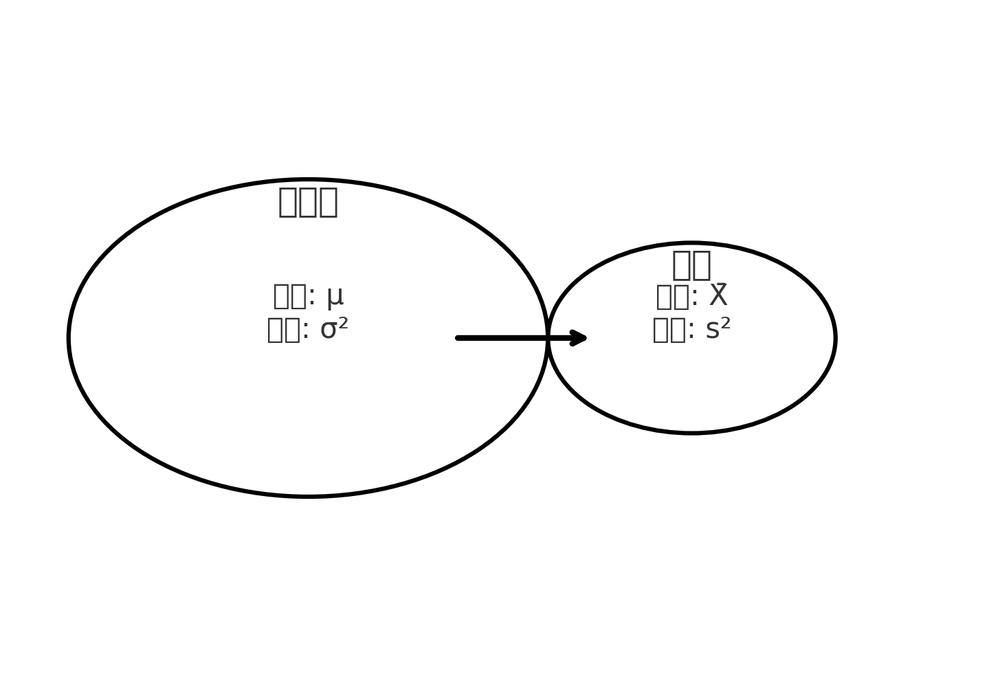

# 통계적 가설검정

가설검정은 특정한 주장을 설정하고, 이를 통계적으로 검토하여 참인지 거짓인지를 판단하는 과정입니다. 가설검정(hypothesis testing)은 확률과 통계 이론을 활용하여 이루어집니다.

## 가설 설정하기

통계적 가설검정에서는 주어진 데이터를 바탕으로 검증할 수 있는 가설을 세웁니다. 일반적으로 평균과 분산 등의 통계량을 기반으로 가설을 설정합니다. 예를 들면 다음과 같은 가설을 세울 수 있습니다.

- 한 집단의 평균이 특정한 값과 같다.
- 두 개의 집단 평균이 동일하다.
- 어떤 처리를 하기 전과 후의 평균이 같다.

가설검정은 자료의 형태, 표본의 크기, 변수의 수 등에 따라 다양한 방법이 존재합니다. 이를 차차 익혀가면서 우선 가설검정의 기본 개념을 이해해 봅시다.

---

## 귀무가설과 대립가설

어떤 모집단이 있다고 가정합시다. 누군가 이 모집단의 평균이 \(\mu\) 라고 주장하고 있습니다. 그런데 우리는 이 주장이 사실과 다를 가능성이 있다고 의심합니다. 따라서 두 가지 가설을 설정할 수 있습니다.

- **귀무가설(H₀)** : 모집단의 평균이 \(\mu\) 이다. (기존의 주장)
- **대립가설(H₁)** : 모집단의 평균이 \(\mu\) 가 아니다. (기존 주장에 반대하는 가설)

귀무가설(null hypothesis)은 기존에 받아들여지는 주장을 의미하며, 이를 기각하고 싶은 경우가 많습니다. 반면 대립가설(alternative hypothesis)은 새로운 주장을 의미하며, 이를 입증하고자 하는 것이 가설검정의 목적입니다.

귀무가설과 대립가설은 반드시 서로 반대되는 관계여야 합니다. 만약 이해가 잘 되지 않는다면 이후의 예제를 통해 좀 더 명확히 알아보겠습니다.

---

## 표본추출과 가설검정

모집단 전체를 조사하면 가장 정확한 결과를 얻을 수 있지만, 시간과 비용의 문제로 인해 현실적으로 어려운 경우가 많습니다. 따라서 모집단에서 일부 데이터를 표본으로 추출하여 분석합니다. 이때 표본에서 계산된 평균과 분산 등을 이용하여 모집단의 특성을 추론하게 됩니다.

아래 그림은 모집단과 표본 간의 관계를 나타냅니다.

표본을 통해 얻은 평균을 \(\bar{X}\), 분산을 \(s²\) 라고 표기하면, 다음과 같이 정리할 수 있습니다.

- **귀무가설(H₀)** : \(E[X] = \mu\) (기존의 주장)
- **대립가설(H₁)** : \(E[X] \neq \mu\) (새로운 주장)

이제 가설검정의 원리를 이해하는 것이 중요합니다. 다음 강의에서는 가설검정이 어떻게 수행되는지를 배워보겠습니다.

---

## 📌 확인 문제

다음 중 **귀무가설(H₀)** 에 해당하는 것은 무엇인가?

1. 모집단의 평균이 기존과 다르다고 주장한다.
2. 모집단의 평균이 기존과 동일하다고 주장한다.
3. 모집단의 분산이 기존보다 크다고 주장한다.
4. 모집단의 평균이 기존보다 작다고 주장한다.

<b>정답 보기</b>

**정답: 2. 모집단의 평균이 기존과 동일하다고 주장한다.**

